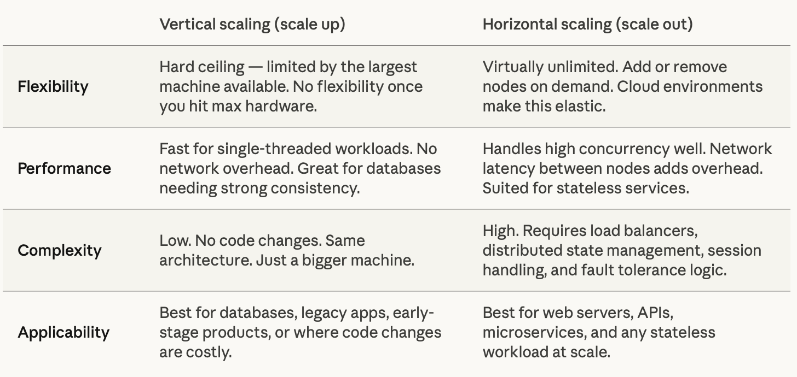
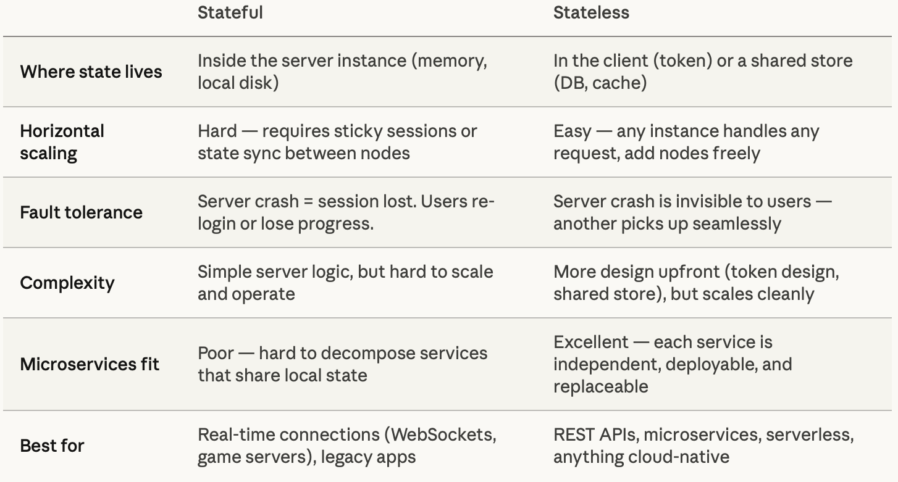
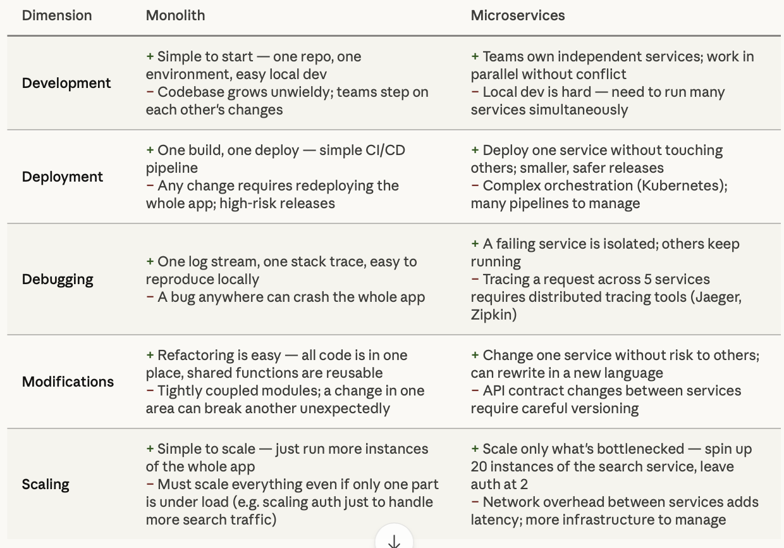

# Scaling and System Architectures

## Overview

This lesson moves into more advanced topics, focusing on how to scale systems both vertically and horizontally. It will also cover the distinctions between stateful and stateless servers, as well as monolithic and microservices architectures.

## Learning Objectives

- Understand vertical and horizontal scaling
- Learn about stateful vs stateless servers
- Understand monolithic vs microservices architectures

## Topics Covered

- Vertical and horizontal scaling
- Stateful vs stateless servers
- Monolithic vs Microservices

## Part 1 - Scaling
Scalability is the capability of a system to handle a growing amount of work or its potential to accommodate growth. There are two main types of scalability: vertical and horizontal scaling. 

**Why do we need scaling?** As a system grows — more users, more data, more traffic — a single server eventually hits its limits. CPU, RAM, and disk all have ceilings. Scaling is the strategy for expanding a system's capacity to handle that load without breaking.

**Vertical Scaling** (also called "scaling up") means upgrading the machine itself — faster CPU, more RAM, bigger disk. It's the simplest fix, but it has hard limits. It involves adding resources to a single node (e.g., upgrading CPU, RAM). This approach is often easier to implement but may face physical limits.

**Horizontal Scaling** (also called "scaling out") means adding more machines and distributing the load across them. A load balancer sits in front and routes traffic to whichever server is available.It involves adding more nodes to the system (e.g., adding more servers to handle load). It is more complex but allows for handling larger loads and redundancy.

**Comparison**

**Quizzes:**

**What is vertical scaling?**

- Adding more nodes
- Upgrading CPU and RAM
- Reducing hardware

**Answer:** Upgrading CPU and RAM

**What is the advantage of horizontal scaling?**

- Less complexity
- No upgrade needed
- More redundancy

**Answer:** More redundancy

### *Load Balancers*

*Load balancers distribute incoming network traffic across several servers to ensure no single server becomes overwhelmed.*

***Types of Load Balancers**:* 
  - *Hardware Load Balancers: Physical devices appliance setups.*
  - *Software Load Balancers: Applications such as HAProxy, NGINX.*

***Benefits**:*
  - *Increases reliability and availability by distributing traffic.*
  - *Supports horizontal scaling by evenly distributing loads.*

## Part 2 - Stateful vs Stateless servers

**Stateful** servers remember client-specific information between requests. The server holds state — session data, connection context, in-progress work — in its own memory or local storage.

Real-world stateful examples: traditional web sessions stored in server memory, WebSocket connections (the server holds the open connection), multiplayer game servers (tracking player positions), and database connections with active transactions.

**Stateless** servers treat every request as brand new. They have no memory of previous interactions — all the context a server needs must be supplied with the request itself (typically in a token, header, or database lookup).

Real-world stateless examples: REST APIs (each request includes auth via JWT or API key), serverless functions (AWS Lambda), CDN edge nodes serving cached content, and most modern microservices.

How this connects to *scaling* and *microservices* is where it all clicks together. Statelessness is what makes horizontal scaling practical. When servers are interchangeable, you can route any request to any instance — meaning your load balancer can freely distribute traffic, and you can spin new instances up or down in seconds. Stateful servers break this because a user's requests must keep hitting the same server ("sticky sessions"), which creates uneven load and a fragile single point of failure per user.
In microservices architecture, statelessness is essentially a design principle. Each service handles a narrow function (auth, payments, search), receives everything it needs in the request, and delegates persistence to a shared backing store — a database, cache like Redis, or a message queue.

**Comparison**

## Part 3 - Monolithic vs Microservices

**A monolith** is a single deployable unit where all the application's functionality — user auth, business logic, database access, notifications — lives in one codebase and runs as one process.

All modules run in the same process, share the same memory, and call each other directly as functions. It deploys as one artifact — one container, one binary, one JAR file.

**Microservices** split those same capabilities into separate, independently deployable services. Each service owns its domain, runs its own process, and communicates with others over the network (HTTP/REST, gRPC, or message queues).

The critical difference from the monolith: services don't share a database. Each owns its data. Coordination happens through APIs and events, not shared memory or SQL joins.

**Comparison**

Rule of thumb: start with a monolith, migrate to microservices when pain points demand it. Most teams that jump straight to microservices regret it early on.

Microservices don't eliminate complexity — they redistribute it. A monolith has complex internal coupling. Microservices trade that for complex operational infrastructure — service discovery, distributed tracing, network reliability, and API versioning. Neither is free. The question is which kind of complexity your team is better equipped to manage.
The classic path most teams take is the strangler fig pattern: start monolithic, identify the modules that need independent scaling or cause the most team friction, and carve them out into services one at a time — without a risky big-bang rewrite.

### Microservices Architecture

Microservices architecture is a design pattern in which a single application is composed of many loosely coupled and independently deployable services. 

- **Characteristics**:
  - Encapsulation of business logic within services.
  - Each microservice is focused on a single function or small area.

- **Pros and Cons**:
  - Facilitates easy deployment and scaling.
  - Can introduce challenges with data consistency and management across services.

- **Examples**:
  - Building a retail application with separate services for product catalog, shopping cart, inventory, etc.

**Quizzes:**

**What is the main advantage of microservices?**

- Coupling services tightly
- Independent deployment
- Single function focus

**Answer:** Independent deployment

**Which architecture model allows each service to focus on a single area?**

- Monolithic
- Microservices
- Service-oriented

**Answer:** Microservices
